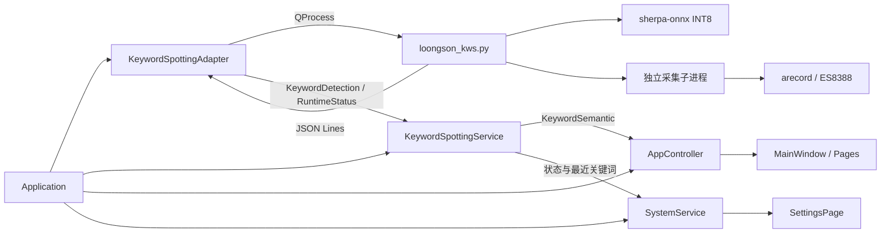

# LongPet V0.2 关键词识别接入与开发板调优报告

> 日期：2026-08-20
> LongPet 基线：`main` / `6ca16d596f7dbb47a989f655bd4c6853430cde70`（工作区同时保留此前尚未提交的 Reminder V0.2 重构）
> KWS 来源：`Justin-fanfan/loongson-kws` / `892d67d9d4a95b80fe96bf5b41b1e81b333c2da2`
> 开发板：Loongson 2K0300 / loongarch64 / Linux 6.12.0.lsgd / ES8388 / Qt 6.5

## 1. 完成结论

本次已经把 `loongson-kws` 的真实离线模型、Python 推理程序、ES8388 采集链路和全部模型资源接入 LongPet，并完成 Windows 回归、LoongArch Release 构建、开发板离线推理、持续采集、异常退出、资源占用和 systemd 常驻测试。

最终状态如下：

- LongPet 页面不依赖 Python、sherpa-onnx、ALSA 或 `QProcess`；
- `Application` 统一创建并管理 KWS Adapter 和 Service；
- `KeywordSpottingAdapter` 负责外部推理进程、JSON 行协议、运行状态、降级和进程生命周期；
- `KeywordSpottingService` 负责关键词到产品语义的映射以及冷却去重；
- `AppController` 负责页面导航、紧急页抢占和提醒上下文确认；
- 模型/依赖缺失、Python 无法启动或运行时退出时，LongPet 继续启动，只将 KWS 标记为不可用；
- 正式程序和 KWS 已由同一个 `longpet.service` cgroup 常驻运行；
- 开发板最终 `NRestarts=0`，整机仍有约 172 MiB available memory；
- 旧正式二进制已保留可回滚备份。

## 2. 架构与数据流



分层职责：

| 层 | 职责 | 明确不负责 |
|---|---|---|
| `platform/KeywordSpottingAdapter` | 运行 Python、解析 JSON、启动/停止、超时、异常降级、父子进程联动 | 产品导航、提醒状态、数据库 |
| `services/KeywordSpottingService` | 语义映射、重复命中冷却、最近关键词状态 | 页面访问、提醒确认规则 |
| `AppController` | 上下文相关动作、提醒确认、紧急页抢占和页面恢复 | 模型加载、音频采集 |
| `SystemService` | 向设置页发布 KWS 状态摘要 | 推理和语义决策 |
| Page/Widget | 显示状态和接收用户触摸 | 访问 Python、ALSA、模型和数据库 |

该结构保持了现有 `Application → AppController → Service → Adapter` 的依赖方向。KWS 运行时是 Python 项目，因此使用一个长期 `QProcess` 作为清晰的 platform 边界；没有在页面中临时调用脚本，也没有按次启动模型。

## 3. 已接入关键词与产品行为

正式关键词文件由原来的 3 个扩展到 7 个：

| 关键词 | 引擎 signal/code | LongPet 行为 | 上下文限制 |
|---|---|---|---|
| 你好 | `GREETING / 1` | 进入 Home，并提示“我在呢” | ReminderAlert 或 Emergency 抢占期间不切页 |
| 救命 | `EMERGENCY / 2` | 主动进入 EmergencyPage | 可抢占普通页面和 ReminderAlert |
| 停止 | `STOP / 3` | 发出 `stopVoicePlaybackRequested()` 能力信号并提示已收到 | 当前没有真实音频播放 Service，因此不伪造“已停止播放”结果 |
| 知道了 | `ACKNOWLEDGE / 4` | 当前提醒记为 `Acknowledged` | 仅当前存在 ReminderAlert 时生效 |
| 好的 | `ACKNOWLEDGE / 4` | 当前提醒记为 `Acknowledged` | 仅当前存在 ReminderAlert 时生效 |
| 完成了 | `COMPLETE / 5` | 当前提醒记为 `Completed` | 仅当前存在 ReminderAlert 时生效 |
| 吃过了 | `COMPLETE / 5` | 当前提醒记为 `Completed` | 仅当前存在 ReminderAlert 时生效 |

提醒语义延续上一轮重构的规则：

- “知道了/好的”只表示老人看见或听见提醒，不会增加 CareService 的用药完成数；
- “完成了/吃过了”才会把 occurrence 标记为 `Completed`；
- 普通陪伴/聊天状态下说“好的”不会误确认不存在的提醒；
- 提醒确认后仍按原逻辑恢复提醒前页面；
- EmergencyPage 抢占 ReminderAlert 时，提醒展示计时暂停；点击“我没事”后返回同一提醒并恢复计时；
- 同时到期的提醒队列仍由原 ReminderService/AppController 流程管理。

语义冷却参数集中在 `KeywordSpottingService`：

- 普通语义冷却：2.5 秒；
- 紧急语义冷却：8 秒。

这些参数不散落在页面代码中。

## 4. KWS 运行时接入

### 4.1 资源

`third_party/loongson-kws/` 整体引入了上游仓库内容，包括：

- INT8 和 FP32 ONNX 模型；
- epoch-12 和 epoch-99 模型文件；
- `tokens.txt`；
- 原始/正式关键词文件；
- 7 条模型测试 WAV；
- 正式 Python 入口；
- 离线测试、录音诊断和回环工具；
- 上游 README 与板端测试报告。

本地导入资源约 37.4 MB；板端解包后为 39 个文件、约 36 MB。未为了当前版本删掉以后可能使用的模型和诊断工具。

CMake 新增完整安装规则：

```text
share/longpet/kws/
```

运行时查找顺序：

1. `LONGPET_KWS_ROOT`；
2. LongPet 可执行文件同目录下的 `kws/`；
3. `../share/longpet/kws/`。

### 4.2 JSON 协议

Python 标准输出仅用于 JSON Lines，诊断文本继续写入标准错误。

关键词事件：

```json
{"event":"keyword_detected","keyword":"知道了","signal":"ACKNOWLEDGE","code":4,"source":"microphone","timestamp":"2026-08-20T19:05:27.760+08:00"}
```

运行状态事件：

```json
{"event":"runtime_status","state":"listening","detail":"离线关键词 · 正在监听","timestamp":"2026-08-20T18:39:31.570+08:00"}
```

已支持的运行状态包括：

- `starting`：模型加载中；
- `listening`：模型和 ES8388 采集均已就绪；
- `stopping/stopped`：正常停止；
- `error`：依赖、模型、采集或推理异常。

### 4.3 降级和生命周期

- Windows 默认不启动真实 KWS，自动化测试不依赖 sherpa-onnx 或 NetworkManager；
- Linux 默认启用，缺少脚本、模型、tokens 或 keywords 时发布错误状态，不影响 LongPet 主流程；
- Python 不存在、进程启动失败、模型加载超时或运行时退出时均只降级 KWS；
- 启动超时为 90 秒，正常板端模型加载约 24～25 秒；
- LongPet 正常退出时先终止 KWS，等待清理，必要时再 kill；
- Linux 使用 `PR_SET_PDEATHSIG(SIGTERM)`：即使 LongPet 被 `SIGKILL`，Python、采集子进程和 `arecord` 也不会永久变成孤儿；
- Python 增加 SIGTERM/SIGINT 处理，正常路径会设置 stop event、join 采集进程并释放声卡；
- 没有新增 Qt 轮询线程；状态和关键词均由 `QProcess`/Qt signal 异步驱动。

### 4.4 单核板优化

2K0300 只有一个 1 GHz CPU 核心。本次加入两项应用侧调优：

1. LongPet UI 先启动，延迟 1.5 秒再启动 KWS 模型，避免首帧和模型初始化同时抢 CPU；
2. KWS 推理父进程设为 nice +5；采集子进程原有 `os.nice(-5)` 会回到 nice 0，使 Qt UI 和 ES8388 采集优先于慢推理。

板端验证：

- 启动约 1 秒时只有 LongPet；
- 启动约 4 秒时 KWS 已出现且 nice 为 +5；
- 模型就绪后采集子进程 nice 为 0；
- 空闲瞬时 CPU：LongPet 约 0%，KWS 主进程约 0.5%，采集子进程约 2%；
- 模型初始化仍会消耗接近一个 CPU 核心，但不会取得高于 UI/采集的调度优先级。

### 4.5 可调环境变量

| 环境变量 | 作用 | 当前默认 |
|---|---|---|
| `LONGPET_KWS_ENABLED` | `0/false/off/no` 可关闭 KWS | Linux 开、Windows 关 |
| `LONGPET_KWS_ROOT` | 指定 KWS 根目录 | 自动查找 |
| `LONGPET_KWS_PYTHON` | Python 可执行文件 | `python3` |
| `LONGPET_KWS_THRESHOLD` | sherpa 关键词阈值 | `0.25` |
| `LONGPET_KWS_SCORE` | sherpa 关键词分数 | `1.5` |

阈值未放到老人设置界面，避免误操作。后续应依据真实正负样本再决定是否做工程/家属端配置。

## 5. UI 改动

### 5.1 设置页

设置页增加“语音关键词”行，显示：

- 未启动；
- 模型加载中；
- 离线关键词 · 正在监听；
- 运行时不可用/错误；
- 最近一次识别关键词。

同时把已有但未显示的电源摘要加入第 4 行。1024×600 离屏渲染已验证 4 行两列完整显示，没有裁切。

### 5.2 EmergencyPage

原工程中已有 EmergencyPage 视觉稿，但未进入 MainWindow 页面栈。本次完成：

- 加入 `PageId::Emergency`；
- 接入“我没事”和“联系家人”的语义信号；
- 支持“救命”从任意普通页面进入；
- 支持抢占 ReminderAlert 并在解除后恢复提醒；
- “联系家人”目前明确提示真实呼叫尚未接入，不伪造已通知家属。

## 6. 修改文件

### 6.1 新增

- `src/model/KeywordSpottingModels.h`
- `src/platform/KeywordSpottingAdapter.h`
- `src/platform/KeywordSpottingAdapter.cpp`
- `src/services/KeywordSpottingService.h`
- `src/services/KeywordSpottingService.cpp`
- `resources/icons/microphone.svg`
- `third_party/loongson-kws/`（完整上游资源）
- `docs/LongPet-V0.2-KWS-Integration-Board-Report.md`

### 6.2 修改

- `CMakeLists.txt`
- `resources/resources.qrc`
- `scripts/build-loongarch.sh`
- `src/app/Application.h`
- `src/app/Application.cpp`
- `src/app/AppController.h`
- `src/app/AppController.cpp`
- `src/mainwindow.h`
- `src/mainwindow.cpp`
- `src/model/SettingsModels.h`
- `src/services/SystemService.h`
- `src/services/SystemService.cpp`
- `src/pages/SettingsPage.h`
- `src/pages/SettingsPage.cpp`
- `src/pages/EmergencyPage.h`
- `src/pages/EmergencyPage.cpp`
- `tests/V02Test.cpp`
- `third_party/loongson-kws/config/keywords.txt`
- `third_party/loongson-kws/src/loongson_kws.py`

`AppController.cpp/.h` 和 `V02Test.cpp` 同时包含此前 Reminder V0.2 的未提交工作；本次在其上做最小增量，没有回退或覆盖提醒重构。

## 7. 构建与自动化测试

### 7.1 Windows Release

- Qt：6.11.2 / MSVC 2022；
- 构建：通过；
- `LongPet.exe`：链接通过；
- `LongPetV02Tests.exe`：链接通过；
- 编译并发：1；
- `/W4` 下未产生本次新增 warning/error。

最终 CTest：

```text
1/1 Test #1: LongPet.V02 ... Passed
100% tests passed, 0 tests failed out of 1
```

Qt Test 明细：20 passed、0 failed、1 skipped。跳过项是默认未设置截图目录；单独设置截图目录后 `renderV02Pages()` 通过，并成功生成 Settings/Emergency 等 8 张 1024×600 截图。

新增覆盖包括：

- KWS disabled 降级；
- keyword JSON 解析；
- runtime status JSON 解析；
- 关键词/信号到语义映射；
- 2.5 秒语义冷却；
- 真实 `KeywordSpottingService signal → AppController` 链路；
- 非 ReminderAlert 上下文不能语音确认提醒；
- “知道了”产生 Acknowledged/Voice 而非 Completed；
- “吃过了”产生 Completed/Voice；
- Greeting 进入 Home；
- Emergency 抢占及恢复；
- Stop 能力信号；
- 设置页 KWS 状态和最近关键词；
- 1024×600 Emergency/Settings 渲染。

原有数据库 migration、Reminder、Network、ALSA/Backlight/Power、状态栏和页面导航测试继续通过。

### 7.2 LoongArch Release

构建脚本增加 `LONGPET_BUILD_JOBS`，本次使用 1 避免高并发占用宿主机内存。最终产物：

```text
ELF 64-bit LSB executable, LoongArch
interpreter /lib64/ld-linux-loongarch-lp64d.so.1
```

配置、编译和链接均通过，无本次新增 warning/error。

## 8. 开发板测试结果

### 8.1 环境

| 项目 | 实测 |
|---|---|
| 内存 | 369 MiB，无 swap |
| Python | 3.12.5 |
| NumPy | 1.25.0 |
| sherpa-onnx | 1.12.15 |
| 声卡 | ES8388 |
| 正式采集 | `hw:0,0` / S16_LE / 44100 Hz / 2 ch / channel 0 |

### 8.2 模型自检

使用 Adapter 同参数 `threshold=0.25`、`score=1.5`：

| 指标 | 结果 |
|---|---:|
| 初始化耗时 | 24.33 秒 |
| 测试音频（含尾静音） | 4.35 秒 |
| 解码耗时 | 3.83 秒 |
| RTF | 0.88 |
| 识别结果 | 朱丽楠 |
| 退出码 | 0 |

### 8.3 21 条普通话 TTS 离线样本

使用 Windows 已安装的普通话音色 Huihui、Kangkang、Yaoyao，为 7 个正式关键词各生成 3 条 16 kHz/16-bit/mono PCM WAV；模型只加载一次，逐条使用正式 keywords、threshold 0.25、score 1.5 解码。

结果：

```text
SUMMARY files=21 hits=21
```

21 条的识别文本均与文件对应关键词完全一致。单条 RTF 约 0.77～1.16。

重要说明：这是合成语音的配置/模型冒烟测试，能够证明新增拼音 token、关键词约束和阈值没有明显错误，但不能代替老人真人、方言口音、距离、电视背景音和负样本的产品指标。

### 8.4 真实 ES8388 持续采集

`--debug --duration 45` 结果：

- 成功进入 `listening`；
- 环境底噪 RMS 约 0.01085；
- 自适应 RMS 触发线约 0.02712；
- 45 秒采集 423 个音频块；
- `arecord` 重启 0 次；
- 丢弃旧语句 0；
- 正常退出码 0；
- 退出后 Python/arecord 均释放。

常驻实测 RSS：

| 进程 | RSS（约） |
|---|---:|
| LongPet | 54～60 MiB |
| KWS 主进程 | 83～85 MiB |
| multiprocessing tracker | 13 MiB |
| 采集子进程 | 35 MiB |
| arecord | 2.7 MiB |

各进程包含共享页，不能直接把 RSS 相加。systemd cgroup 的实际 `MemoryCurrent` 约 106 MiB，`MemoryPeak` 约 109 MiB；最终整机 available memory 约 172 MiB。

### 8.5 异常退出

候选 LongPet 与 KWS 完成加载后，对 Qt 主进程执行 `SIGKILL`：

- KWS 主进程收到 parent-death signal；
- multiprocessing 子进程退出；
- `arecord` 退出；
- 8 秒后没有相关残留进程；
- available memory 从组合运行时约 171 MiB 恢复到约 241 MiB。

### 8.6 正式 systemd 常驻

最终状态：

```text
longpet.service: active (running)
NRestarts=0
```

同一 cgroup 中存在 LongPet、KWS 主进程、采集子进程和 `arecord`，NetworkManager backend 和 ES8388 ALSA 音量 Adapter 也正常加载。

## 9. 板端部署与回滚

正式文件：

| 路径 | 说明 |
|---|---|
| `/root/mytest/qt/LongPet` | 最终正式程序 |
| `/root/mytest/qt/kws/` | 完整 KWS 运行时和模型 |
| `/root/mytest/qt/LongPet.pre-kws-20260820-185752` | 部署前正式二进制备份 |
| `/root/mytest/qt/kws-self-test-tuned.stdout` | 调优参数自检 JSON |
| `/root/mytest/qt/kws-self-test-tuned.stderr` | 调优参数自检性能日志 |
| `/root/mytest/qt/kws-live.stdout` | 45 秒监听状态 JSON |
| `/root/mytest/qt/kws-live.stderr` | 45 秒 VAD/采集日志 |
| `/root/mytest/qt/kws-tts-eval-results.log` | 21 条 TTS 批量结果 |

正式 LongPet SHA-256：

```text
d230578d4e3b4cc38988c24677385c5aff4e4d8d45fa2c32bbeb4d69f1641d59
```

如需回滚：

```bash
systemctl stop longpet.service
cp /root/mytest/qt/LongPet.pre-kws-20260820-185752 /root/mytest/qt/LongPet
chmod 755 /root/mytest/qt/LongPet
systemctl start longpet.service
```

## 10. 已真实实现与仅预留能力

### 10.1 已真实实现

- sherpa-onnx INT8 模型真实加载；
- ES8388 麦克风持续采集；
- 独立 arecord 采集与慢推理解耦；
- 7 个关键词配置和 JSON signal/code；
- Qt 长期进程 Adapter；
- 自动运行状态更新和设置页显示；
- 语义冷却；
- Greeting/Home；
- EmergencyPage 抢占；
- ReminderAlert 上下文 Acknowledged/Completed；
- 父进程死亡清理；
- 模型/依赖异常降级；
- CMake 安装资源；
- systemd 常驻部署。

### 10.2 仅预留或尚未接入

- `stopVoicePlaybackRequested()` 只有干净的控制接口；当前没有正式 AudioPlayback/TTS Service；
- EmergencyPage 的“联系家人”没有 FamilyLink/电话能力，不会真实拨号或发送消息；
- 没有完整 ASR、自由对话、TTS 或音频播报；
- 没有把 KWS 阈值做成用户设置；
- 没有伪造 Family App 网络同步；
- 没有对“救命”自动上报云端或家属端；
- 没有产品级真人数据集的召回率/误触发率结论。

## 11. 需要确认和后续注意事项

### 11.1 必须进行的真人验收

建议在设备实际摆放位置完成以下录音/统计，而不是只口头试几次：

1. 7 个关键词，每个至少 50～100 条正样本；
2. 老人、家属、男女不同说话人；
3. 20 cm、50 cm、1 m 距离；
4. 正面、侧面、背对设备；
5. 安静、电视、音乐、风扇、多人对话环境；
6. 大量不包含关键词的连续负样本；
7. 重点统计“好的”这种常见短语的误触发；
8. 重点统计“救命”的误触发和漏检，不能只追求召回率。

应记录 Recall、False Reject Rate、False Accept Rate、平均/P95 延迟和连续运行稳定性，再决定是否继续使用 0.25/1.5。

### 11.2 需要产品侧敲定

1. “停止”的正式含义：当前只发出停止播报能力信号，不会关闭提醒、不记 Acknowledged；后续需要确定它应停止 TTS、录音、对话还是全部媒体。
2. “救命”后的动作：当前只进入安全确认页；需要确定何时联系家属、是否倒计时、是否允许取消，以及通信失败的降级方案。
3. “好的”是否保留：它自然度高，但也是高频日常词，产品化前可能需要改成更不易误触发的短语。
4. KWS 是否 24 小时常驻：当前空闲 CPU 低，但冷启动约 24 秒，推理时延数秒；上游报告也建议未来使用更轻量的一级唤醒词模型。

### 11.3 音频全双工

上游板端报告确认当前 ES8388 路径在录音占用时，板载播放回环可能阻塞。未来接入提醒语音/TTS 时必须专项验证：

- 是否需要播报期间暂停 KWS；
- 是否能使用独立 PCM 设备或正确配置全双工；
- 是否需要回声消除，避免设备自己的播报触发“好的/停止”等关键词；
- 暂停采集后如何恢复并重新校准底噪。

### 11.4 性能限制

- 单核 1 GHz 环境下模型初始化约 24 秒；
- 短指令单条 RTF 在部分样本上略高于 1；
- 连续快速说话时仍可能排队或丢弃旧语句；
- 本次 nice/延迟启动改善了 UI 和采集优先级，没有改变模型本身的计算量；
- 如果要求低延迟全天候唤醒，建议训练/替换更小的固定词前级模型。

### 11.5 许可

上游模型 README 标注 Apache License 2.0；`loongson-kws` 自编代码当前没有单独许可证声明。正式发布或对外分发前，应由仓库所有者补充清晰的软件许可和第三方模型 NOTICE，不能只根据模型许可推定全部代码许可。

## 12. 最终状态

截至报告完成时：

- 本地 Release 构建通过；
- CTest 100% 通过；
- LoongArch Release 构建通过；
- 板端自检通过；
- 21/21 合成普通话关键词通过；
- ES8388 45 秒持续监听通过；
- 异常退出清理通过；
- 正式 `longpet.service` active；
- `NRestarts=0`；
- 旧二进制可回滚；
- 剩余主要工作是目标人群真人语音数据标定、真实紧急通信和后续音频播放/全双工能力。
