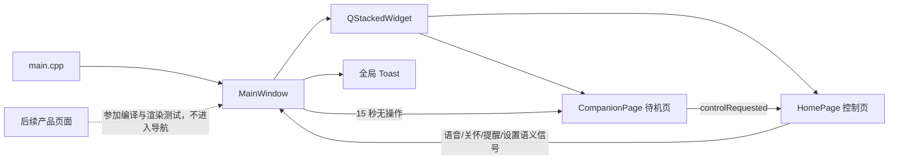

# LongPet V0.1 工作报告

- 完成日期：2026-08-13
- 项目目录：`D:\code_qt\longpet`
- 版本：`0.1.0`
- 结论：V0.1 正式 UI 主路径已完成，Release 构建、安装、自动化测试和原生窗口渲染回归均通过。

## 1. 工作依据与架构结论

本次实现以以下两份来源为准：

1. GitHub 的 [`longpet-architecture-package`](https://github.com/Justin-fanfan/longpetui_2/tree/longpet-architecture-package) 分支，核对提交为 `4618ea34f7bbc07f5affa7be0c35650b38232255`；
2. 本机 UI 设计目录 `C:\Users\18214\Desktop\longpetui_2`，核对提交为 `aae822299d982900c22141fad61ae670b700b9be`，并保留了该工作区中原有的 `CompanionPage.cpp` 待机表情修改。

已完整阅读架构包中的总览、规则与清单，以及 `device/app`、`device/model`、`device/services`、`device/platform`、`device/connectivity`、`device/features`、`device/ui`、`external`、`flows`、`runtime`、`build`、`roadmap` 等目录下的架构说明。得到的 V0.1 边界是：

- V0.1 是正式产品 UI 外壳，不提前伪造尚未实现的业务能力；
- 正式运行路径只需要待机陪伴页和首页控制页；
- 页面向上发送语义信号，页面切换和全局提示由 `MainWindow` 统一管理；
- 未接入的入口要如实反馈，不能展示假成功、假状态或假数据；
- 待机动画要低刷新、低重绘，静态内容应缓存；
- Demo 导航、组件展厅和工程调试页不能进入正式产品路径；
- 后续产品页面和通用组件可以先迁入，但在完成数据模型、Service 和语义接口前不能冒充已完成能力。

本次实现严格按以上边界执行，同时按要求保留了可复用的产品页、组件和全量资源。

## 2. V0.1 已完成范围

### 2.1 正式运行主路径



正式应用启动后：

1. 默认显示 `CompanionPage`；
2. 宠物使用 `DefaultOpen` 睁眼微笑表情；
3. 整屏透明触控层接收点击，发出 `controlRequested`；
4. `MainWindow` 切换到 `HomePage` 并启动 15 秒单次计时器；
5. 首页任意子控件上的鼠标、触摸或按键操作都会重新计时；
6. 无操作超时后自动返回待机页并停止计时器；
7. 首页四个入口目前发出语义信号，由 `MainWindow` 显示“功能将在后续版本接入”的非模态 Toast，不制造业务已完成的假象。

### 2.2 正式首页内容

- 1024×600 逻辑画布；
- 顶部显示本机真实日期和时间，每 30 秒用低精度计时器更新；
- 顶部设置入口；
- 中央低成本宠物表情和“你好，我一直在呢”文案；
- “陪我说话”“今日关怀”“提醒”三个大触控按钮；
- Toast 新消息会覆盖旧消息并重置隐藏计时，不会被旧计时器提前关闭；
- 当前未接真实来源的天气、网络和电量没有显示成假状态。

### 2.3 页面接口边界

正式页没有把按钮指针作为业务 API 暴露给外部：

- `CompanionPage::controlRequested()`；
- `HomePage::talkRequested()`；
- `HomePage::careRequested()`；
- `HomePage::reminderRequested()`；
- `HomePage::settingsRequested()`。

`MainWindow` 是唯一的正式页面切换和全局 Toast 协调者。这样后续接入 Service 时，业务层只处理用户意图，不依赖具体按钮实现。

### 2.4 宠物表情的资源约束

`PetFaceWidget` 保留了完整表情集合，并采用以下低开销策略：

- 静态表情渲染到缓存图像；
- 尺寸或屏幕像素比变化时才使缓存失效；
- 眨眼只更新眼部区域；
- 倾听、思考、说话只重绘动态区域；
- 连续表情约 3.1～4.5 FPS；
- 不可见时停止动画和眨眼计时器；
- 待机页使用静态缓存加低频眨眼，不运行高刷新动画。

## 3. 已迁入并保留的 UI 资产

### 3.1 产品页面

以下 9 个页面实现文件组已经迁入正式仓库并加入 CMake：

| 页面 | 当前状态 | V0.1 正式导航 |
|---|---|---|
| `CompanionPage` | 正式待机页 | 是 |
| `HomePage` | 正式控制页 | 是 |
| `ConversationPage` | 倾听、思考、说话三种视觉态 | 否 |
| `CarePage` | 关怀页视觉稿 | 否 |
| `ReminderPage` | 提醒列表视觉稿 | 否 |
| `ReminderEditPage` | 提醒编辑视觉稿 | 否 |
| `SettingsPage` | 设置页视觉稿 | 否 |
| `EmergencyPage` | 紧急状态视觉稿 | 否 |
| `SleepPage` | 睡眠页视觉稿 | 否 |

这些后续页面没有为了缩小 V0.1 而删除。它们全部参加 Release 编译，并逐页执行 1024×600 构造和截图测试。需要注意：这些页面中的部分数据、开关和状态仍是设计演示内容，部分接口仍是控件 getter；在进入正式导航前必须改为模型输入和语义信号。

没有复制 `DemoWindow`、`UiGalleryPage` 和 `EngineeringPage`。这三项属于 Demo、组件展厅或工程调试入口，不是产品页面；它们仍完整保留在 UI 设计仓库中，没有被删除或改写。

### 3.2 通用组件

完整迁入：

- `PetFaceWidget`；
- `VisualComponents`：图标、操作按钮、状态栏、页头、卡片、设置行、提醒项、Toast；
- `VisualTokens`：颜色和 1024×600 布局度量。

### 3.3 资源

已将 UI 设计目录中的资源一次性迁入：

- 26 个 SVG 图标；
- 1 份全局 QSS；
- 合计 27 个 `.qrc` 条目；
- 逐项检查结果：27 项全部存在，26 个 SVG 全部可由 `QSvgRenderer` 正确解析；
- 正式源码和资源中没有本机绝对路径，运行时不依赖 UI 设计目录。

这使尚未进入导航的产品页也拥有完整资源，避免后续逐页启用时出现遗漏。

## 4. 主要代码与构建改动

| 文件或目录 | 改动 |
|---|---|
| `CMakeLists.txt` | 建立 Qt 6.5+、C++17 正式目标；加入全部产品页、组件和 QRC；启用严格警告；增加可选测试目标和安装规则 |
| `src/main.cpp` | 设置应用元信息，加载内嵌 QSS，创建正式 `MainWindow` |
| `src/mainwindow.*` | 实现页面栈、整屏唤出、15 秒返回、交互续时、全局 Toast 和入口语义处理 |
| `src/pages/` | 迁入并保留 9 个产品页面实现；正式重构待机页和首页语义接口 |
| `src/widgets/` | 迁入完整视觉组件、Token 和低开销宠物表情实现 |
| `resources/` | 迁入全量 QSS、SVG 并注册到 QRC |
| `tests/V01UiTest.cpp` | 增加正式 UI 主路径、资源、信号、计时器、提示语、页面构造与截图回归 |
| `.gitignore` | 忽略构建产物和本机 IDE 状态 |
| `.gitattributes` | 固定源码、脚本、资源和文档的行尾策略 |
| `README.md` | 补充版本范围、构建方法、目录和后续页面边界 |

## 5. 验证记录

### 5.1 验证环境

- Windows 11；
- Qt 6.11.0 Release；
- GCC 13.1.0 / MinGW 64 位；
- CMake + Ninja；
- 逻辑画布 1024×600；系统显示缩放 125%，截图物理尺寸为 1280×750。

### 5.2 Release 构建与安装

使用全新的 `build-win-final` 目录配置和构建，未复用旧对象文件：

- CMake 配置：通过；
- 18 个构建步骤：全部通过；
- 编译器警告：0；
- 链接：通过；
- 安装规则：通过；
- 安装产物：`build-win-final/install/bin/LongPet.exe`。

### 5.3 自动化测试

CTest 结果：

```text
100% tests passed, 0 tests failed out of 1
```

原生 Windows 窗口 Qt Test 结果：

```text
Totals: 10 passed, 0 failed, 0 skipped, 0 blacklisted
```

覆盖内容：

1. QSS 和 26 个 SVG 均已内嵌且可读取；
2. 7 类后续产品页、会话页 3 种状态均可构造和渲染；
3. 正式程序以 1024×600 待机页启动；
4. 待机表情为 `DefaultOpen`，控制页计时器未误启动；
5. 待机页与首页发出正确语义信号；
6. 整屏点击进入首页；
7. 无操作超时返回待机页；
8. 首页子控件交互会重新计时；
9. 四个未接入口均显示准确提示语；
10. 正式待机页、首页、Toast 及全部保留产品页完成截图回归。

本轮共生成并人工检查 12 张原生窗口截图：`companion`、`home`、`home-toast`、三种 `conversation` 状态、`care`、`reminder`、`reminder-edit`、`settings`、`emergency`、`sleep`。没有发现白底泄漏、裁切、溢出、资源缺失或中文乱码。

### 5.4 静态边界检查

- `MainWindow` 只实例化 `CompanionPage` 和 `HomePage`；
- 正式源码中没有 `DemoWindow`、`UiGalleryPage`、`EngineeringPage`；
- 没有 `QMessageBox` 阻塞式提示；
- 没有提前引入数据库、网络、串口、推理运行时等未到版本的依赖；
- 源码、资源和测试中没有用户目录或 Linux 用户目录绝对路径；
- `.qrc` 27 个条目，缺失数为 0；
- `git diff --check` 通过；
- UI 设计仓库未被本次实现写入，原有工作区修改保持不变。

## 6. 当前明确不属于“已完成业务”的内容

V0.1 完成的是可运行、可验证的正式 UI 外壳。以下能力仍未实现，界面入口不会假装成功：

- 语音采集、识别、对话、合成与打断；
- 今日关怀的数据来源和策略；
- 提醒的增删改查、持久化和调度；
- 设置项的真实读写；
- 网络、电量、天气等真实设备状态；
- 紧急状态识别、联系人和通知链路；
- 睡眠数据来源；
- 视觉、运动和远端通信能力。

保留页面目前应被理解为“已迁入并持续验证的产品视觉资产”，不能据此对外宣称对应业务已经完成。

## 7. 需要敲定的事项

建议在开始下一版本前确认以下决策：

1. **控制页停留时间**：当前采用架构允许范围的上限 15 秒。若实际使用中操作节奏更慢，可改为配置项；V0.1 不建议继续延长而不做实机观察。
2. **后续接入顺序**：建议先接提醒与设置的数据模型，再接关怀，最后接语音会话。这样可先验证页面—Service—持久化的完整链路，再引入更复杂的实时状态机。
3. **状态栏策略**：目前只显示真实本地日期和时间。建议在系统状态 Service 就绪前继续隐藏天气、网络和电量，不使用固定演示值。
4. **设置入口边界**：V0.1 点击设置仍显示未接入提示；如果希望设置页提前进入正式导航，需要先确定哪些设置确实可以持久化，避免只有视觉开关。
5. **紧急功能责任边界**：需要产品侧明确异常来源、触发条件、误报处理、联系人数据、取消流程和告警失败兜底，之后才能启用紧急页。
6. **中文字库**：当前 Windows 依赖系统中文字体。发布到目标设备时应随镜像或应用包提供并验证中文字体，避免回退字体缺失。
7. **发布包形态**：CMake 安装目标当前产出应用可执行文件；若需要在没有 Qt 开发环境的 Windows 机器上分发，还要确定 DLL、平台插件、SVG 插件和字体的统一打包方式。

## 8. 后续实施建议与注意事项

### 下一版本进入导航前

- 将保留页面中的控件 getter 改为语义信号；
- 将固定文案、时间、状态和示例记录改为 ViewModel/Model 输入；
- 为每项能力定义 Service 接口和错误态，不让页面直接操作硬件或存储；
- 为页面切换、业务超时、失败、取消和重试增加状态机测试；
- 只有在数据来源真实、失败路径完整后才把页面加入 `MainWindow` 导航。

### 设备验收

- 检查全屏显示、屏幕方向、中文字体和 1024×600 逻辑尺寸；
- 检查整屏唤出、按钮热区、触摸校准和连续操作时的 15 秒续时；
- 测量待机与动画状态的 CPU、内存、温度和长时间运行稳定性；
- 检查休眠/唤醒、系统时间变化、前后台切换后的计时器行为；
- 检查高频点击时 Toast 不叠加、不提前消失。

### 代码维护

- 不要把 Demo 导航或静态假数据重新接回正式主路径；
- 新资源统一放入 `resources/` 并加入 `.qrc`，同时更新资源完整性测试；
- 保持 `MainWindow` 只负责 UI 编排，不在其中堆积业务逻辑；
- PetFace 新动画继续遵守低 FPS、局部重绘、不可见即停的约束；
- 建议在合并前运行 Release 构建和 `LongPet.V01.Ui` 测试。

## 9. 交付结论

LongPet V0.1 已达到本轮定义的交付条件：正式 UI 主路径可运行，待机—唤出—控制—超时返回闭环完整，未实现入口反馈真实；未来产品页、通用组件和全量资源均已安全迁入并持续参加编译/渲染检查；构建、安装、自动化测试和视觉回归均通过。

下一阶段可以在不重复搬运 UI 资产的前提下，按架构顺序为保留页面接入模型、Service 和真实数据。
