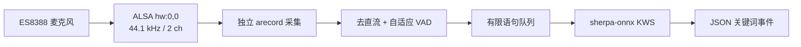

# 龙芯板离线语音关键词识别模块

面向龙芯 2K0300（LoongArch64）开发板和 ES8388 音频编解码器的离线关键词识别模块。项目基于 sherpa-onnx Zipformer KWS 模型，已在单核 1 GHz 板端完成真实麦克风验证，可识别“你好”“救命”“停止”并输出便于上层程序消费的 JSON 事件。

## 主要特性

- 完全离线运行，不依赖云端语音服务
- 适配 ES8388：44.1 kHz、双通道、channel 0
- 独立 `arecord` 采集进程，避免慢推理阻塞麦克风
- 自适应能量 VAD、语音前置缓冲和有限队列
- 支持 INT8/FP32、自检、WAV 解码和限时稳定性测试
- 标准输出仅产生 JSON 事件，诊断信息写入标准错误

## 工作流程



## 目录结构

```text
.
├── config/
│   └── keywords.txt              # 正式关键词配置
├── docs/
│   └── Loongson-KWS-Test-Report.md
├── models/
│   └── sherpa-onnx-kws-.../      # ONNX 权重、tokens 和测试音频
├── src/
│   └── loongson_kws.py           # 正式程序入口
├── tools/                         # 板卡、录音和离线推理诊断工具
├── requirements.txt
└── README.md
```

本地历史备份、缓存和运行日志统一放在 `.artifacts/`，不会提交到 Git。

## 运行环境

板端验证环境：

- Loongson 2K0300 / LoongArch64
- Linux 6.12.0.lsgd
- ES8388，ALSA 设备 `hw:0,0`
- Python 3
- sherpa-onnx 1.12.15 / ONNX Runtime
- ALSA 工具：`arecord`、`amixer`（回环测试还会使用 `aplay`）

安装系统工具和 Python 依赖：

```bash
sudo apt install alsa-utils libportaudio2
python3 -m pip install -r requirements.txt
```

> LoongArch 环境可能需要使用与板端系统匹配的 sherpa-onnx wheel；若 PyPI 没有兼容包，请沿用板上已验证的 1.12.15 安装包。

## 快速开始

在项目根目录运行：

```bash
python3 src/loongson_kws.py
```

程序会配置 ES8388 输入增益、加载 INT8 模型、校准约 1.5 秒环境底噪，然后开始监听。

常用命令：

```bash
# 显示音频/VAD/推理诊断信息
python3 src/loongson_kws.py --debug

# 使用模型自带音频做离线自检
python3 src/loongson_kws.py --self-test

# 解码指定的 16-bit PCM WAV
python3 src/loongson_kws.py --wav /path/to/audio.wav

# 监听 60 秒后自动退出
python3 src/loongson_kws.py --duration 60

# 查看 PortAudio 输入设备
python3 src/loongson_kws.py --list-devices

# 临时调整关键词阈值与分数
python3 src/loongson_kws.py --threshold 0.25 --score 1.2
```

## 输出接口

识别成功时，标准输出产生一行 JSON：

```json
{"event":"keyword_detected","keyword":"你好","signal":"GREETING","code":1,"source":"microphone","timestamp":"2026-08-20T10:00:00.000+08:00"}
```

默认信号映射：

| 关键词 | `signal` | `code` |
|---|---|---:|
| 你好 | `GREETING` | 1 |
| 救命 | `EMERGENCY` | 2 |
| 停止 | `STOP` | 3 |

需要修改关键词时，应同时更新 `config/keywords.txt` 中的拼音 token 配置，以及 `src/loongson_kws.py` 中的 `KEYWORD_SIGNALS` 映射。

## 诊断工具

`tools/` 中保留了开发板验收过程中使用的工具：

- `board_info.sh`：采集 CPU、Python、依赖和 ALSA 信息
- `offline_kws_test.py`：批量验证模型自带 WAV
- `arecord_stats.py`、`arecord_level_meter.py`：检查 ALSA 通道电平
- `audio_probe.py`、`signal_stats.py`：检查 PortAudio 输入和慢消费者行为
- `acoustic_loopback.py`：播放并录制回环实验

完整测试数据、性能结论和已知限制见 [龙芯 2K0300 平台关键词识别测试与实现报告](docs/Loongson-KWS-Test-Report.md)。

## 已知限制

- 在单核 1 GHz 2K0300 上，综合 RTF 可能大于 1，识别会有数秒延迟。
- 过载时程序会丢弃最旧的未处理语句，以避免延迟无限增长。
- 当前阈值偏向召回率，产品化前仍需使用真实正负样本标定误触发率。
- 音频参数和 mixer 控件针对当前 ES8388 板卡验证，其他板型可能需要调整。

## 模型来源与许可

仓库中的 KWS 模型来源于 ModelScope 的 `pkufool/sherpa-onnx-kws-zipformer-wenetspeech-3.3M-2024-01-01`，模型说明标注为 Apache License 2.0。项目自编代码当前未附加单独的开源许可证；未经许可，不应据此推定额外授权。
