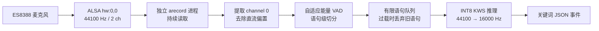

# 龙芯 2K0300 平台关键词识别测试与实现报告

> 仓库整理说明：本报告保留板端测试过程和原始结论；当前正式入口为
> `src/loongson_kws.py`，关键词配置位于 `config/keywords.txt`，模型位于
> `models/`。历史备份与运行日志仅在本地 `.artifacts/` 中保留，不纳入版本控制。

## 1. 报告信息

| 项目 | 内容 |
|---|---|
| 项目名称 | 龙芯 2K0300 + ES8388 嵌入式关键词识别 |
| 目标平台 | Loongson-2K0300 开发板 |
| 操作系统 | Linux 6.12.0.lsgd，loongarch64 |
| 测试目录 | `/root/mytest/ycxuan` |
| 正式程序 | `/root/mytest/ycxuan/src/loongson_kws.py` |
| 模型 | sherpa-onnx KWS Zipformer WenetSpeech 3.3M |
| 推理精度 | INT8 |
| 推理框架 | sherpa-onnx 1.12.15 / ONNX Runtime |
| 麦克风编解码器 | ES8388 |
| 报告日期 | 2026-08-13 |

---

## 2. 项目目标

本次工作的目标是在龙芯 2K0300 开发板上实现可实际运行的本地关键词识别功能，通过 ES8388 麦克风持续监听以下三个关键词：

| 关键词 | 输出信号 | 数值编码 |
|---|---|---:|
| 你好 | `GREETING` | 1 |
| 救命 | `EMERGENCY` | 2 |
| 停止 | `STOP` | 3 |

系统需要满足以下要求：

1. 能够使用板载 ES8388 麦克风采集真实语音。
2. 能够在龙芯 2K0300 上完成本地 INT8 模型推理。
3. 检测到关键词后以结构化 JSON 输出事件。
4. 推理较慢时，麦克风采集不能停止或永久阻塞。
5. 程序应支持持续运行、主动退出、故障诊断和离线自检。

---

## 3. 硬件与软件环境

### 3.1 处理器

开发板实测 CPU 信息如下：

```text
Model Name : Loongson-2K0300
ISA        : loongarch64
CPU 核心数 : 1
CPU 频率   : 1000 MHz
Features   : cpucfg lam fpu crc32 lspw
```

该系统当前只向 Linux 暴露一个 1 GHz CPU 核心，且没有 LSX/LASX 向量扩展。因此，模型推理不存在通过增加线程数或启用 LoongArch 向量指令获得明显加速的条件。

### 3.2 音频设备

ALSA 检测到的 ES8388 设备包括：

```text
card 0: ES8388, device 0
card 0: ES8388, device 1
```

PortAudio 检测到：

```text
0 ES8388: - (hw:0,0), ALSA (2 in, 2 out)
1 ES8388: - (hw:0,1), ALSA (2 in, 2 out)
2 sysdefault, ALSA
3 default, ALSA
```

最终采用的录音配置为：

```text
ALSA 设备       : hw:0,0
采样率          : 44100 Hz
输入通道数      : 2
有效麦克风声道  : channel 0
采样格式        : S16_LE
采集方式        : arecord -M
```

分别测试 `hw:0,0` 和 `hw:0,1` 后，两者都能使用 `arecord -M` 连续录满 8 秒并正常退出。信号统计表明，`hw:0,0` 的 channel 0 有效信号相对更高，因此正式程序固定使用该输入。

### 3.3 语音模型

模型目录：

```text
/root/mytest/ycxuan/
└── models/
    └── sherpa-onnx-kws-zipformer-wenetspeech-3.3M-2024-01-01/
```

正式程序加载以下 INT8 模型：

```text
encoder-epoch-12-avg-2-chunk-16-left-64.int8.onnx
decoder-epoch-12-avg-2-chunk-16-left-64.int8.onnx
joiner-epoch-12-avg-2-chunk-16-left-64.int8.onnx
tokens.txt
```

自定义关键词文件：

```text
/root/mytest/ycxuan/config/keywords.txt
```

其内容对应“你好”“救命”“停止”的拼音 token 及中文输出标签。

---

## 4. 原始问题现象

旧版程序使用如下串行结构：

```python
while True:
    samples, overflowed = microphone.read(frames)
    stream.accept_waveform(44100, samples)

    while kws.is_ready(stream):
        kws.decode_stream(stream)
```

程序启动后可以正常完成：

1. 麦克风参数检查；
2. KWS 模型加载；
3. PortAudio 输入流打开；
4. 首批音频读取；
5. 44.1 kHz 到 16 kHz 重采样器创建。

随后出现以下现象：

```text
监听中。
请说出关键词：你好 / 救命 / 停止
按 Ctrl+C 退出。

Creating a resampler:
  in_sample_rate: 44100
  output_sample_rate: 16000

^C^C^C^C^C
```

同时观察到：

- 模型加载时 CPU 接近 100%；
- 程序“卡死”时 CPU 占用很低；
- 多次按下 `Ctrl+C` 也无法及时退出；
- 终端没有新的识别或状态输出。

---

## 5. 性能测试与初步分析

### 5.1 INT8 推理性能

对 2 秒音频进行 INT8 KWS 基准测试，结果为：

| 指标 | 测试结果 |
|---|---:|
| INT8 KWS 初始化耗时 | 约 25.5 秒 |
| `accept_waveform()` 总耗时 | 约 0.209 秒 |
| 单次 `decode_stream()` | 约 0.96～1.00 秒 |
| 5 次 decode 总耗时 | 约 4.836 秒 |
| 2 秒音频总处理耗时 | 约 5.045 秒 |
| RTF | 约 2.522 |

RTF（Real-Time Factor）计算如下：

```text
RTF = 处理耗时 / 音频时长
    = 5.045 / 2
    ≈ 2.522
```

这意味着处理 1 秒音频平均需要约 2.52 秒，当前模型无法在该单核 1 GHz CPU 上实现严格实时流式推理。

### 5.2 INT8 与 FP32 对比

测试发现 INT8 没有带来明显推理加速：

| 指标 | FP32 | INT8 |
|---|---:|---:|
| 模型初始化 | 约 26.5 秒 | 约 25.5 秒 |
| 单次 decode | 约 0.90～1.08 秒 | 约 0.96～0.99 秒 |
| 2 秒音频处理 | 约 5 秒 | 约 5.045 秒 |
| RTF | 约 2.5 | 约 2.522 |

INT8 显著减小了模型文件和内存占用，但由于目标 CPU 缺少高效的向量化 INT8 kernel，实际计算吞吐没有改善。

### 5.3 重采样不是主要瓶颈

首次向 sherpa-onnx 输入 44.1 kHz 音频时会显示：

```text
Creating a resampler:
  in_sample_rate: 44100
  output_sample_rate: 16000
```

实测单个 100 ms 音频块的 `accept_waveform()` 约为 10 ms。因此，44.1 kHz 到 16 kHz 的重采样虽然存在，但不是导致程序长期无响应的主要原因。

---

## 6. 卡死根因定位

### 6.1 内核级证据

在旧 `test.py` 出现低 CPU、无法退出的状态时，检查其进程：

```text
PID     STAT  CPU   WCHAN        COMMAND
150983  S+    2.3%  do_sys_poll  python3 test.py
```

内核等待栈为：

```text
do_sys_poll
sys_ppoll
do_syscall
handle_syscall
```

该进程打开的唯一额外设备文件是：

```text
/dev/snd/pcmC0D0c
```

上述证据说明进程当时没有在执行 ONNX 推理，而是睡眠在声卡输入设备的轮询等待中。

### 6.2 复现实验

进行了三类对照测试。

#### 测试一：连续阻塞读取

使用 `sounddevice.InputStream.read()` 连续读取 30 个 100 ms 音频块：

```text
#0  elapsed ≈ 0.100s
#1  elapsed ≈ 0.099s
...
#29 elapsed ≈ 0.098s
DONE
```

在应用持续读取时，阻塞读取可以正常工作。

#### 测试二：模拟慢推理

每读取 4 个 100 ms 音频块后暂停 1 秒，模拟 `decode_stream()`：

```text
read × 4
sleep 1 second
read × 4
sleep 1 second
...
```

程序无法在设置的 12 秒期限内完成，需要被外部超时终止，成功复现旧版程序的异常表现。

#### 测试三：回调采集与慢消费者

回调线程持续录音，消费者每处理 4 个音频块后暂停 1 秒。测试结果：

```text
运行时长       : 10 秒
收到回调       : 105 次
消费者处理     : 40 块
主动丢弃旧块   : 61 块
PortAudio 错误 : 0
正常退出       : 是
```

这证明采集与推理解耦后，慢推理不会直接阻塞声卡采集。

### 6.3 根因结论

旧程序的根本问题不是单一模型死锁，而是以下因素共同造成：

1. 麦克风读取和 KWS 推理位于同一线程；
2. 单次模型解码约阻塞 1 秒；
3. 推理期间应用不读取声卡；
4. ES8388/ALSA/PortAudio 输入缓冲可能发生 overflow 或 xrun；
5. 后续 `Pa_ReadStream()`/`poll()` 无法按预期恢复；
6. Python 主线程阻塞在原生调用中，无法及时处理 `KeyboardInterrupt`；
7. 程序没有循环状态日志，因此终端表现为完全静止。

最终可将旧问题定性为：

> 慢推理诱发的音频输入停读，以及 PortAudio 阻塞读取路径在 ES8388 驱动上的恢复异常。

---

## 7. 最终方案设计

### 7.1 总体架构

最终程序不再由主进程直接持有阻塞式 PortAudio 输入流，而是使用独立录音进程执行 `arecord -M`，并将采集、语音切分和模型推理解耦。



### 7.2 独立录音进程

录音进程使用：

```bash
arecord -M \
  -D hw:0,0 \
  -t raw \
  -f S16_LE \
  -c 2 \
  -r 44100 \
  -q
```

该进程只负责持续读取 PCM，不执行 sherpa-onnx 推理。即使主进程长时间占用 CPU 解码，录音仍可继续进行。

程序还包含录音看门狗：若一定时间内没有新 PCM 数据，则停止并重新启动 `arecord`。连续恢复失败达到上限时，程序会明确报告错误，而不是永久静默阻塞。

### 7.3 自适应 VAD 与语句切分

为了避免将不连续的音频块直接送入流式 KWS，程序先利用轻量能量检测切出完整语句。

处理步骤如下：

1. 启动后采集约 1.5 秒环境音；
2. 估算当前环境底噪 RMS；
3. 每个音频块先去除直流分量；
4. 同时根据 RMS 和 peak 判断语音起点；
5. 保存约 0.45 秒语音前置缓冲，避免切掉关键词开头；
6. 连续静音约 0.65 秒后结束当前语句；
7. 单条语句最长约 5.5 秒；
8. 将完整语句提交给 KWS 主进程。

人工测试时测得：

```text
环境底噪 RMS : 约 0.00091
VAD RMS 触发线: 约 0.00300
```

说词时音量明显越过阈值，VAD 能够正确检测语音活动。

### 7.4 有限队列与过载策略

2K0300 的模型推理速度不能严格实时，因此系统必须避免无限积压。

最终方案使用有限语句队列。当推理速度跟不上时：

- 录音进程继续采集；
- VAD 继续切分新语句；
- 队列满时丢弃最旧的未处理语句；
- 保留较新的语音，避免延迟无限增长；
- 日志记录丢弃计数，便于诊断。

该策略优先保证系统活性和对最新指令的响应能力。

### 7.5 语音归一化

ES8388 实际语音幅度会随距离和说话音量变化。送入模型前，程序会：

1. 再次去除直流分量；
2. 测量语句峰值；
3. 在限定范围内自动计算软件增益；
4. 将样本限制在 `[-1.0, 1.0]`；
5. 以连续 `float32` 数组送入 sherpa-onnx。

这可以提升较小音量语音的可识别性，同时避免无限放大底噪。

### 7.6 结构化输出

识别到关键词后，标准输出产生单行 JSON。例如：

```json
{"event":"keyword_detected","keyword":"你好","signal":"GREETING","code":1,"source":"microphone","timestamp":"2024-07-24T21:02:31.280+08:00"}
```

其他状态和诊断日志输出到标准错误，因此上层程序可以只读取标准输出中的 JSON 事件。

---

## 8. 模型正确性验证

### 8.1 模型自带测试音频

模型目录包含 7 条 16 kHz 标准测试音频。使用模型配套关键词文件进行离线测试，INT8 模型成功识别其中 4 条：

| 测试音频 | 识别结果 |
|---|---|
| `3.wav` | 文森特卡索 |
| `4.wav` | 蒋友伯 |
| `5.wav` | 周望军 |
| `6.wav` | 朱丽楠 |

汇总：

```text
测试文件数 : 7
命中数     : 4
```

该测试证明以下链路在 LoongArch 板端工作正常：

- INT8 ONNX 模型加载；
- sherpa-onnx 推理；
- tokens 解析；
- 关键词约束解码；
- UTF-8 中文结果输出。

### 8.2 正式程序自检

部署后的正式程序执行：

```bash
python3 src/loongson_kws.py --self-test
```

实测结果：

```text
模型加载耗时 : 24.29 秒
测试音频时长 : 4.35 秒（含尾部静音）
解码耗时     : 3.83 秒
RTF          : 0.88
识别结果     : 朱丽楠
退出码       : 0
```

输出事件：

```json
{"event":"keyword_detected","keyword":"朱丽楠","signal":"KEYWORD_DETECTED","code":0,"source":"self_test"}
```

---

## 9. 真实麦克风全链路测试

### 9.1 测试方法

测试者面对板载麦克风，在约 20～50 cm 距离依次说出：

```text
你好
救命
停止
```

每个关键词之间停顿约 1～2 秒。程序同时记录音频电平、VAD、语句切分、KWS 耗时和 JSON 输出。

### 9.2 测试结果

三个目标关键词均从真实麦克风音频中成功识别：

| 实际说词 | 模型输出 | 信号 | 编码 | 结果 |
|---|---|---|---:|---|
| 你好 | 你好 | `GREETING` | 1 | 通过 |
| 救命 | 救命 | `EMERGENCY` | 2 | 通过 |
| 停止 | 停止 | `STOP` | 3 | 通过 |

实际输出示例：

```json
{"event":"keyword_detected","keyword":"你好","signal":"GREETING","code":1,"source":"microphone"}
{"event":"keyword_detected","keyword":"救命","signal":"EMERGENCY","code":2,"source":"microphone"}
{"event":"keyword_detected","keyword":"停止","signal":"STOP","code":3,"source":"microphone"}
```

### 9.3 实际推理耗时

| 语句 | 音频时长 | 解码次数 | 推理耗时 | RTF | 结果 |
|---|---:|---:|---:|---:|---|
| 语句 1 | 5.50 秒 | 11 | 10.89 秒 | 1.73 | 你好 |
| 语句 2 | 5.50 秒 | 5 | 5.28 秒 | 0.84 | 救命 |
| 语句 3 | 5.50 秒 | 7 | 7.13 秒 | 1.13 | 你好 |
| 语句 4 | 3.20 秒 | 6 | 5.97 秒 | 1.49 | 停止 |

测试过程中出现过一次额外的“你好”结果，说明当前阈值具有较高召回率，但仍存在误触发或语句边界合并的优化空间。

### 9.4 采集稳定性验证

最关键的验证发生在第一条语句推理期间：

```text
推理开始前音频块计数 : 193
推理结束后音频块计数 : 302
推理耗时             : 10.89 秒
录音停止             : 否
录音进程重启         : 0 次
```

这说明即使 KWS 推理占用唯一 CPU 核心长达约 10.9 秒，独立录音进程仍持续接收音频，没有再次卡在 `do_sys_poll`，原始假死问题已从架构上解决。

---

## 10. 正式部署结果

正式程序已经部署到：

```text
/root/mytest/ycxuan/src/loongson_kws.py
```

部署完成后执行了以下检查：

1. Python 语法编译通过；
2. 候选程序与正式程序内容一致；
3. 文件具有可执行权限；
4. 标准音频自检通过；
5. 自检结束后麦克风没有残留占用；
6. 真实麦克风三个关键词均识别成功。

旧正式程序已备份为：

```text
/root/mytest/ycxuan/.artifacts/legacy/1.py.before-final-20260812
```

---

## 11. 使用方法

### 11.1 启动关键词监听

```bash
cd /root/mytest/ycxuan
python3 src/loongson_kws.py
```

启动过程包括：

1. 配置 ES8388 输入增益；
2. 加载 INT8 模型，约需 24～25 秒；
3. 启动独立 `arecord` 采集进程；
4. 采集约 1.5 秒环境底噪；
5. 显示“现在可以说关键词”；
6. 开始识别“你好/救命/停止”。

### 11.2 开启详细诊断日志

```bash
python3 src/loongson_kws.py --debug
```

诊断模式会显示：

- 当前 RMS 和 peak；
- 环境底噪；
- VAD 触发阈值；
- 已采集音频块数；
- `arecord` 自恢复次数；
- 语句长度和峰值；
- 模型解码次数、耗时和 RTF；
- 关键词原始结果。

### 11.3 运行模型自检

```bash
python3 src/loongson_kws.py --self-test
```

预期返回退出码 0，并输出标准关键词测试结果。

### 11.4 解码指定 WAV 文件

```bash
python3 src/loongson_kws.py --wav /path/to/audio.wav
```

默认使用正式的 `keywords.txt`。WAV 文件应为 16-bit PCM 格式。

### 11.5 限时运行

```bash
python3 src/loongson_kws.py --duration 60
```

程序完成模型加载后监听 60 秒，然后主动释放录音资源并退出。该参数适合自动化稳定性测试。

### 11.6 查看音频设备

```bash
python3 src/loongson_kws.py --list-devices
```

### 11.7 调整关键词阈值

程序当前默认参数为：

```text
keywords_threshold = 0.20
keywords_score     = 1.50
```

可通过命令行临时调整：

```bash
python3 src/loongson_kws.py --threshold 0.25 --score 1.2
```

一般规律：

- 提高 `threshold`：减少误触发，但可能增加漏检；
- 降低 `threshold`：提高召回率，但可能增加误触发；
- 提高 `score`：增强目标关键词在约束解码中的权重。

---

## 12. JSON 接口说明

正式事件格式：

```json
{
  "event": "keyword_detected",
  "keyword": "你好",
  "signal": "GREETING",
  "code": 1,
  "source": "microphone",
  "timestamp": "2024-07-24T21:02:31.280+08:00"
}
```

字段说明：

| 字段 | 类型 | 说明 |
|---|---|---|
| `event` | string | 固定为 `keyword_detected` |
| `keyword` | string | 模型识别到的中文关键词 |
| `signal` | string | 供上层控制程序使用的信号名 |
| `code` | integer | 关键词数值编码 |
| `source` | string | `microphone`、`wav` 或 `self_test` |
| `timestamp` | string | 带时区的 ISO 8601 时间戳 |

上层程序可以逐行读取标准输出并解析 JSON。诊断日志写入标准错误，不会污染标准 JSON 数据流。

---

## 13. 已知限制

### 13.1 模型无法严格实时

2K0300 当前只有一个 1 GHz CPU 核心，INT8 KWS 综合 RTF 仍可能大于 1。因此：

- 识别结果会有数秒延迟；
- 用户连续快速说多条指令时，未处理语句可能积压；
- 队列满时程序会主动丢弃旧语句；
- 该模型不适合作为低功耗、零延迟的 24 小时常驻唤醒前端。

最终方案解决的是“持续可用和不假死”，不是将模型计算本身变成实时。

### 13.2 存在误触发调优空间

人工测试中三个目标词全部命中，但出现过一次额外“你好”结果。可能原因包括：

- 三个关键词在较短时间内连续说出，VAD 语句边界发生合并；
- 环境回声或尾音与关键词 token 路径相似；
- 当前阈值偏向召回率；
- 语句自动增益放大了部分非目标音频。

建议使用真实使用环境中的正样本和负样本进一步标定阈值。

### 13.3 系统时间不正确

开发板测试期间系统时间显示为 2024 年，而实际报告日期为 2026 年。因此，测试日志与 JSON 中的 `timestamp` 不是实际日期。

正式部署前应配置 RTC 或 NTP，例如：

```bash
date
```

确认系统时间正确后再依赖事件时间戳。

### 13.4 ES8388 全双工限制

测试发现录音占用当前 ES8388 输入路径时，使用同一设备播放测试音频会阻塞，当前驱动或设备配置未实现可用的全双工声学回环。因此最终验证采用人工说词，而不是板载扬声器自动播放并录回。

---

## 14. 后续优化建议

### 14.1 优先更换更轻量的前级唤醒模型

推荐的产品级结构为：


前级唤醒模型应满足：

- RTF 明显小于 1；
- 内存占用低；
- 单核标量 CPU 可运行；
- 支持固定唤醒词；
- 能够长期持续监听。

当前 Zipformer KWS 更适合作为唤醒后的二级关键词或短指令识别器。

### 14.2 建立真实数据集调参

建议采集以下数据：

- 每个目标词至少 50～100 条；
- 不同说话人、距离和方向；
- 安静、风扇、音乐、多人交谈等环境；
- 大量不含关键词的负样本；
- 易混淆短语和同音词。

统计指标应包括：

```text
Recall / 召回率
False Reject Rate / 漏检率
False Accept Rate / 误触发率
平均识别延迟
P95 识别延迟
连续运行稳定性
```

### 14.3 优化 VAD 边界

当前人工测试中的语句最长达到 5.5 秒，说明说词期间可能存在持续背景音或边界合并。后续可以：

- 使用频带能量而非全频 RMS；
- 加入零交叉率或谱熵；
- 使用轻量 WebRTC VAD；
- 缩短最大语句时长；
- 对连续关键词强制分段；
- 对单次命中后设置短暂冷却时间。

### 14.4 增加服务化管理

正式产品部署可将程序配置为系统服务，实现：

- 开机自动启动；
- 异常自动重启；
- 日志轮转；
- 健康检查；
- 上层控制程序通过管道或本地 Socket 接收事件。

### 14.5 性能层优化

如果继续使用当前模型，可评估：

- 编译更适合 LoongArch 标量执行的 ONNX Runtime；
- 对算子进行针对性 profiling；
- 减少特征或模型维度；
- 重新训练更小的固定词 KWS 模型；
- 使用 TFLite Micro、NCNN 或专用轻量推理实现；
- 若硬件允许，启用更多 CPU 核心或专用加速单元。

---

## 15. 最终结论

本次工作已经在龙芯 2K0300 开发板上完成真实可用的关键词识别闭环：

1. ES8388 麦克风能够持续采集 44.1 kHz 双通道音频；
2. `hw:0,0` 的 channel 0 被确定为正式输入；
3. sherpa-onnx INT8 KWS 模型可以在 LoongArch 平台正确加载和解码；
4. 原程序假死被精确定位为声卡阻塞读取路径，而非重采样或 ONNX 永久死锁；
5. 最终方案通过独立 `arecord` 进程、VAD、有限队列和语句级解码消除了采集假死；
6. 真实麦克风人工测试成功识别“你好”“救命”“停止”；
7. 三个关键词均输出了正确的 JSON 信号与编码；
8. 最长约 10.9 秒的推理期间，录音仍持续进行；
9. 正式程序已部署并通过语法检查、离线自检和音频资源释放检查。

当前系统已经达到比赛演示和功能验证所需的可用状态。其主要剩余问题不是程序稳定性，而是单核 1 GHz CPU 上模型推理速度较慢，以及误触发率仍需通过真实数据进一步调优。

---

## 附录 A：关键文件

| 文件 | 用途 |
|---|---|
| `/root/mytest/ycxuan/src/loongson_kws.py` | 正式关键词识别程序 |
| `/root/mytest/ycxuan/config/keywords.txt` | 自定义关键词配置 |
| `/root/mytest/ycxuan/models/sherpa-onnx-kws-zipformer-wenetspeech-3.3M-2024-01-01/` | 模型、tokens 和标准测试音频 |

## 附录 B：常用命令

```bash
cd /root/mytest/ycxuan

# 正式运行
python3 src/loongson_kws.py

# 显示详细音频和推理状态
python3 src/loongson_kws.py --debug

# 模型自检
python3 src/loongson_kws.py --self-test

# 限时稳定性测试
python3 src/loongson_kws.py --debug --duration 60

# 查看输入设备
python3 src/loongson_kws.py --list-devices

# 解码指定 WAV
python3 src/loongson_kws.py --wav /path/to/audio.wav
```

## 附录 C：验收状态

| 验收项目 | 状态 |
|---|---|
| ES8388 录音 | 通过 |
| 44.1 kHz 双通道采集 | 通过 |
| channel 0 有效输入 | 通过 |
| INT8 模型加载 | 通过 |
| 离线关键词自检 | 通过 |
| “你好”真实麦克风识别 | 通过 |
| “救命”真实麦克风识别 | 通过 |
| “停止”真实麦克风识别 | 通过 |
| JSON 事件输出 | 通过 |
| 推理期间持续录音 | 通过 |
| 程序主动退出与资源释放 | 通过 |
| 严格实时推理 | 未达到，受当前硬件算力限制 |
| 误触发率产品级标定 | 待后续数据集验证 |
